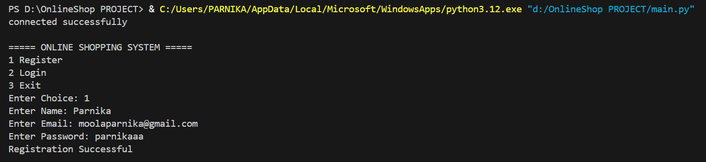
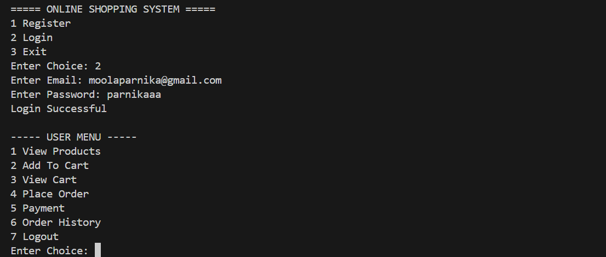
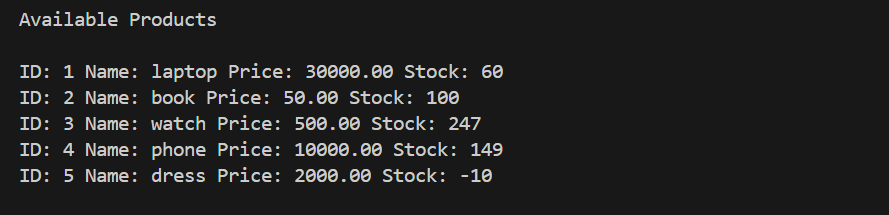
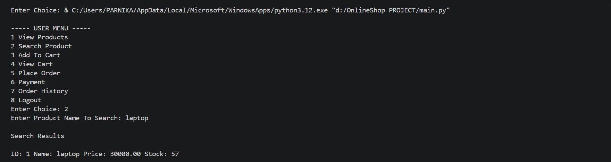
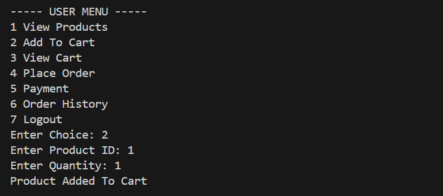
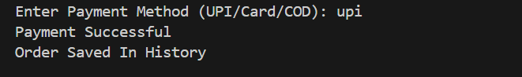
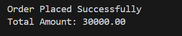
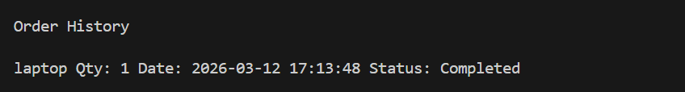

# Online Shopping System (Python + MySQL)

A console-based backend Online Shopping System developed using Python and MySQL.

## Features

- User Registration
- User Login Authentication
- Password Hashing using SHA-256
- View Products
- search products
- Add Products to Cart
- View Cart
- Place Orders
- Payment System
- Order History
- Stock Management

## Technologies Used

- Python
- MySQL
- SQL
- GitHub

## Project Structure

Online-shop-Project  
│  
├── main.py  
├── database.sql  
├── requirements.txt  
└── Project screenshots  

## How to Run the Project

1. Install Python
2. Install MySQL
3. Create database
CREATE DATABASE onlineshop;
5. Run the SQL file

database.sql

5. Install dependency

pip install -r requirements.txt

6. Run the program

python main.py

## Project Screenshots

### Registration

### Login

### View Products

### Search Products

### Add To Cart

### View Cart

### Payment

### Place Order

### Order History

### Logout

### Exit

## Author

Developed using Python and MySQL as a backend project.
